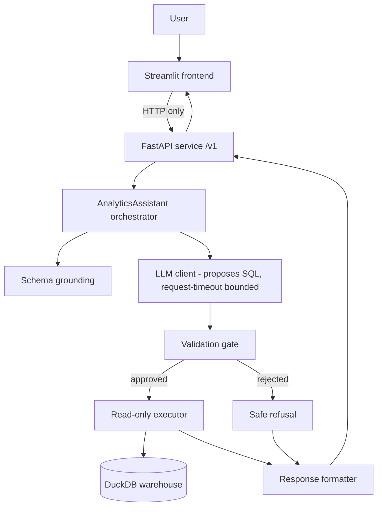
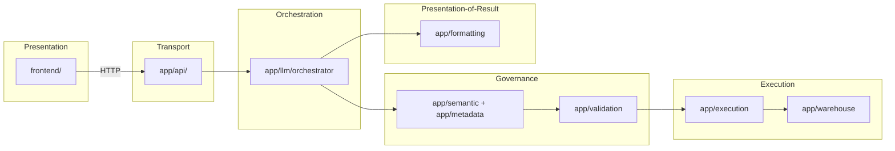
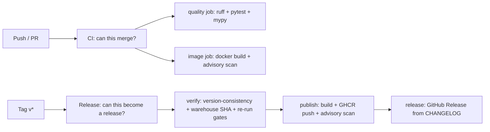

# Architecture State — Solstice Intelligence

**Snapshot as of:** Milestone 3 complete (Phase E, Operational Hardening) — release `v1.3.0`
**Purpose:** the authoritative architecture reference. A new engineer should be
able to read this document and understand the system without reading the project's
development history. This describes *architecture*, not history.

---

## 1. Repository Purpose

Solstice Intelligence is a **governed natural-language analytics assistant**. A
user asks a business question in plain English; the system produces a validated
answer computed against a dimensional data warehouse, and returns the exact SQL
that ran alongside a plain-English explanation.

Its defining property is governance: a large language model (LLM) proposes SQL,
but that SQL is treated as untrusted and must pass a strict validation gate before
anything executes. The organizing principle throughout is:

> **The LLM reasons. The warehouse provides truth. Validation decides trust.**

The LLM never touches the database directly.

---

## 2. High-Level Architecture



Two processes at runtime: the **backend service** (FastAPI over the governed
engine) and the **frontend** (Streamlit). They communicate only over HTTP. In a
public deployment the paid endpoint is protected by the Deployment Access Guard
(§14); the operational endpoints (`/health`, `/ready`, `/version`) stay open and
never call the LLM.

---

## 3. Layered Architecture



Dependencies point in one direction: presentation depends on transport, transport
depends on the engine, the engine depends on the warehouse. Nothing lower depends
on anything higher. The frontend depends on nothing in `app/` — only on the HTTP
contract.

---

## 4. Directory Structure

```
app/
    config.py settings loading
    warehouse/     read-only DuckDB connection + schema introspection
    metadata/      structural warehouse metadata
    models/ reserved namespace for shared internal models (currently empty)
    semantic/      grounding: presenting the schema to the LLM
    validation/    SQL validation gate (parsing, rules, bounds, decision, gate)
    execution/     read-only query executor + typed results
    llm/           LLM client, tool definition, orchestrator (AnalyticsAssistant)
    formatting/    deterministic response formatting (formatter, response, templates)
    api/           init.py, access_guard.py Deployment Access Guard (rate limiter + optional demo gate), build_info.py version/milestone reader (single-sourced from pyproject), logging_config.py structured, metadata-only logging (JSON/text; idempotent), readiness.py live warehouse reachability probe (SELECT 1; no LLM), dependencies.py DI providers (get_assistant, ...), main.py app factory, lifespan, request-ID middleware, guard state, mapping.py internal result -> public contract, models.py frozen public /v1 request/response contract, routes.py HTTP handlers (/v1/ask, /health, /ready, /version)
frontend/
    config.py      presentation/client config (API URL, timeout, page)
    models.py      typed mirror of the public API contract + client Protocol
    api_client.py  the sole HTTP boundary (RealApiClient)
    fake_client.py test double implementing the same Protocol
    components.py  pure rendering functions
    streamlit_app.py  the UI entry point
    frontend/tests/    frontend tests
scripts/
    init.py developer tooling package (not part of the runtime pipeline)
    verify_env.py deterministic environment diagnostic
    check_version.py deterministic version-consistency checker (release)
    inspect_schema.py, smoke_test_openai.py developer utilities
data/
    solstice_apparel.duckdb bundled certified warehouse artifact (~34.5 MB, read-only)
    solstice_apparel.duckdb.sha256 canonical machine-readable checksum (validated at release)
    README.md provenance
tests/             backend & tooling tests
docs/    
    adr/          ADR-004 … ADR-013
    assets/ UI screenshots / demo
    developer/ Developer_Guide.md, Deployment_Guide.md, Release_Guide.md
    phase_completion_milestone3/ Phase_A/B/C/D/E completion reports
.github/
    workflows/ ci.yml CI: "can this merge?" (quality + image jobs), release.yml Release: "can this become an official release?" (tag-driven)
Dockerfile, .dockerignore reproducible image (digest-pinned base, non-root, runtime-only)
render.yaml deployment blueprint
requirements.txt runtime dependencies (pinned ==)
requirements-dev.txt development / tooling dependencies (pinned ==)
justfile developer task runner (convenience)
pyproject.toml     centralized tool configuration and the SOLE version definition
CHANGELOG.md Keep-a-Changelog release history
README.md, LICENSE
```

---

## 5. Responsibilities of Every Major Package

- **`app/warehouse`** — opens the DuckDB warehouse read-only and introspects its
  live schema. The physical read-only guarantee originates here.
- **`app/metadata`** — a typed, structural description of the warehouse.
- **`app/models`** — reserved namespace for shared internal models; currently empty.
- **`app/semantic`** — grounding: turning metadata into the LLM's schema context.
- **`app/validation`** — the trust boundary: parse, rules, bounds, approve/reject.
- **`app/execution`** — runs only approved queries, read-only, row-cap backstop.
- **`app/llm`** — the LLM client (sole SDK boundary, request-timeout bounded), the
  single tool, and the orchestrator.
- **`app/formatting`** — structured response + template explanation; the LLM never
  interprets data.
- **`app/api`** — the FastAPI service: the frozen public `/v1` contract, request
  validation, DI, health/readiness/version endpoints, the internal→public mapping,
  the Deployment Access Guard, version metadata (`build_info.py`), structured
  logging (`logging_config.py`), and the live readiness probe (`readiness.py`).
- **`frontend`** — the Streamlit presentation layer, a pure HTTP client of the API.

---

## 6. Data Flow

1. A question arrives (frontend → API, or directly to the API).
2. The orchestrator grounds the question in the live schema.
3. The LLM proposes SQL via the single permitted tool (the call is timeout-bounded).
4. The proposed SQL passes through the validation gate.
5. If approved, the read-only executor runs it; if rejected, a safe refusal is produced.
6. The formatter builds a structured response plus a plain explanation and the exact SQL.
7. The API returns the public-contract response; the frontend renders it.

An LLM timeout surfaces as an ordinary non-success outcome through the existing
formatter (§7), not as a raw error.

---

## 7. LLM Boundaries

- The LLM is reached through exactly one module (`app/llm/client.py`).
- Its only sanctioned action is to call one tool that proposes a SQL string.
- The proposed SQL is powerless until the validation gate approves it.
- The LLM never executes SQL, never sees raw results to interpret, and never
  narrates the answer — explanations are template-based and deterministic.
- The provider/model identity is internal and never appears in the public contract.
- **The provider call is bounded by a repository-owned request timeout** (default
  60s, `OPENAI_TIMEOUT_SECONDS`). A timeout raises `LLMTimeoutError` (a subclass of
  `LLMError`), which the existing provider-failure path renders as a non-success
  outcome — no orchestrator or contract change.

---

## 8. Validation Pipeline

Allowlist-first, defense-in-depth, pure (`validate(sql, schema) -> result`): parse
(DuckDB dialect) → read-only statement type → every source allowlisted against real
warehouse tables (table functions and empty-named sources rejected structurally) →
column checks → function denylist → bounds (LIMIT injected/clamped) → approve or
reject. A rejection is a legitimate, explained outcome. **Unchanged in Phase E.**

---

## 9. Execution Pipeline

Accepts only gate-approved SQL (a typed trust boundary), executes read-only against
DuckDB, applies an independent row-cap backstop, and returns typed results.
Runtime SQL errors are captured as structured errors, never raw tracebacks.
**Unchanged in Phase E.**

---

## 10. Frontend Architecture

A thin Streamlit client whose only backend contact is HTTP to the `/v1` API. One
module (`api_client.py`) owns the HTTP implementation behind a small `Protocol`;
rendering components are pure. Each request sends exactly one question (single-turn
by design); a render-only transcript provides conversational feel.

---

## 11. Testing Architecture

- **Deterministic and zero-cost.** The LLM is faked and HTTP is mocked; no test
  needs the network, a real AI call, or secrets.
- Backend tests cover each engine layer, the API contract and HTTP semantics, and
  adversarial validation cases.
- Frontend tests cover the API client, pure components, and the interaction flow.
- Tooling and operational tests cover the environment diagnostic (`verify_env`),
  the Deployment Access Guard, version metadata (`build_info`), the
  version-consistency checker (`check_version`), the structured logging formatter,
  the **metadata-only logging invariant** (end-to-end), timeout resolution and
  handling, and the live readiness probe.
- The assembled Streamlit UI is verified manually (honest scoping).

Current suite: **147 tests passing**, **88% coverage** (informational). mypy checks
**47 source files**, zero findings.

---

## 12. Dependency Philosophy

One-way dependency flow, no cycles. Each external system is isolated behind a single
module (AI SDK behind the LLM client; HTTP behind the API client) for minimal blast
radius. The frontend couples to the public contract, never to internal types.
Runtime and development dependencies are separated and pinned exactly, so installs
are reproducible and the blocking gates are deterministic.

---

## 13. CI/CD Architecture

Two workflows with different guarantees:



- **CI** (`ci.yml`, every push/PR): a **quality** job (blocking Ruff, pytest, mypy;
  advisory coverage and pip-audit) and an **image** job (blocking `docker build`;
  advisory Trivy scan). Python 3.14. Actions on `checkout@v5` / `setup-python@v6`.
- **Release** (`release.yml`, on `v*` tags and manual `workflow_dispatch`):
  independent, higher-assurance verification — version consistency, warehouse
  provenance (SHA-256 sidecar), and a re-run of the blocking gates — then image
  build, GHCR publish (built-in `GITHUB_TOKEN`, least privilege), and GitHub Release
  creation from `CHANGELOG.md`.

Both use no secrets beyond `GITHUB_TOKEN` and spend no OpenAI credit. CI answers
"can this merge?"; the release workflow answers "can this become an official
release?" — an independent verification, not duplication.

---

## 14. Deployment & Operational Architecture

- Packaged as a reproducible Docker image: base pinned by digest, non-root, runtime
  dependencies only, cache-friendly layers. `OPENAI_MODEL` pinned to a dated snapshot.
- The certified warehouse is bundled read-only with a machine-readable SHA-256
  sidecar validated at release.
- **Deployment Access Guard** (ADR-012): a route-level dependency on `POST /v1/ask`
  (deterministic in-memory rate limiter + optional Demo Access Gate token) that
  exists solely to protect OpenAI spend; defaults disabled; the OpenAI account hard
  budget cap is the platform-independent financial backstop.
- **Operational hardening** (ADR-013):
  - *Structured, metadata-only logging* (`logging_config.py`) — JSON in deployment,
    text locally; configured once and idempotently; keyed by the existing
    correlation ID.
  - *Repository-owned request timeout* at the LLM-client seam (default 60s,
    `OPENAI_TIMEOUT_SECONDS`); `LLMTimeoutError` flows through the existing
    non-success path.
  - *Graceful shutdown* draining in-flight requests; structured startup diagnostics.
  - *Live readiness* (`readiness.py`): `GET /ready` runs `SELECT 1` on the read-only
    warehouse — no LLM call. `GET /health` is pure liveness.
- `OPENAI_API_KEY` is injected as a platform secret; it never appears in an image
  layer, the repository, or a log line. Deployment blueprint: `render.yaml`.

---

## 15. Release Engineering

`pyproject.toml` is the single version source; `GET /version` derives from it via
`build_info.py`; `scripts/check_version.py` enforces tag ↔ `pyproject` at release
(transitively guaranteeing tag ↔ `/version`). Releases are tag-driven and verified
before publish; images publish to GHCR; GitHub Releases are generated from
`CHANGELOG.md`; the bundled warehouse is validated against its `.sha256` sidecar.
See `docs/developer/Release_Guide.md`.

---

## 16. ADR Summary

| ADR | Subject |
|---|---|
| ADR-004 | Structural metadata layer |
| ADR-005 | SQL validation gate |
| ADR-006 | Execution engine |
| ADR-007 | LLM orchestration |
| ADR-008 | Response formatting (deterministic, no LLM narration) |
| ADR-009 | API service boundary (frozen `/v1` contract, HTTP semantics, lifecycle) |
| ADR-010 | Frontend–backend HTTP boundary |
| ADR-011 | CI & quality-gate policy (blocking vs advisory; mypy promotion) |
| ADR-012 | Deployment architecture & cost safety (guard, bundled warehouse, image) |
| ADR-013 | Operational observability & resilience (logging, timeout, shutdown, readiness) |

---

## 17. Important Invariants

- The LLM is never trusted to execute SQL directly; only gate-approved SQL reaches
  the executor.
- Execution is read-only, with an independent row-cap backstop.
- The frontend never imports backend modules — HTTP only.
- The public API contract excludes implementation details (provider/model).
- Explanations are template-based; the LLM never narrates results.
- **Operational logs are metadata-only** (ADR-013): they may contain request IDs,
  lifecycle events, timing, status codes, and operational diagnostics, and must
  never contain prompts, generated SQL, warehouse query results, model responses,
  user data, API keys, or secrets. This is enforced and tested.
- The provider call is bounded by a repository-owned timeout; a timeout fails safely
  through the existing non-success path.
- `/health` and `/ready` never call the LLM.
- CI and the release workflow require no secrets beyond `GITHUB_TOKEN` and spend no
  API credit.
- The Deployment Access Guard defaults to disabled and never affects local dev/CI.
- `pyproject.toml` is the sole version definition; releases are verified tag-driven
  events; the bundled warehouse is validated against its recorded provenance.
- Milestones 1 and 2 and the governed engine are frozen.

---

## 18. Files That Should Rarely Change

- The validation gate (`app/validation/*`) — the security-critical trust boundary.
- The execution engine (`app/execution/*`) — the read-only guarantees.
- The public API models (`app/api/models.py`) — the frozen contract.
- The LLM client boundary (`app/llm/client.py`) — the single SDK contact point.
- The ADRs — historical decisions; add new ones rather than rewriting old ones.

---

## 19. Extension Points

- **New clients** (React, CLI, chat bots) — build against the frozen `/v1` contract.
- **New analytics capability** — extend the engine behind the API without altering
  the contract.
- **New quality checks** — add advisory CI steps; promote to blocking once clean.
- **Observability platform** (metrics, tracing, dashboards) — a future direction
  beyond Milestone 3, built on the structured logging foundation Phase E established.

---

## 20. Technical Debt

- Minor, cosmetic: raw floating-point execution-time values are not rounded for
  display. No structural or security debt is outstanding; the type checker is at
  zero findings.
- The warehouse-provenance release check is shell (not a unit-tested `scripts/`
  module) — an accepted tradeoff for a single hash comparison.

---

## 21. Milestone Status & Future Evolution

**Milestone 3 (Production Engineering) is complete at `v1.3.0`.** Phases delivered:
A (CI & quality gates), B (developer experience), C (deployment), D (release
engineering), E (operational hardening).

Deferred by design (future directions, not omissions): an observability platform
(metrics/tracing/dashboards) built on the Phase E logging foundation; conversation
memory / multi-turn; authentication as a product feature; caching; automatic
query-repair loops; usage persistence; shared-state rate limiting. Any future change
to a frozen layer should be justified by an ADR.
