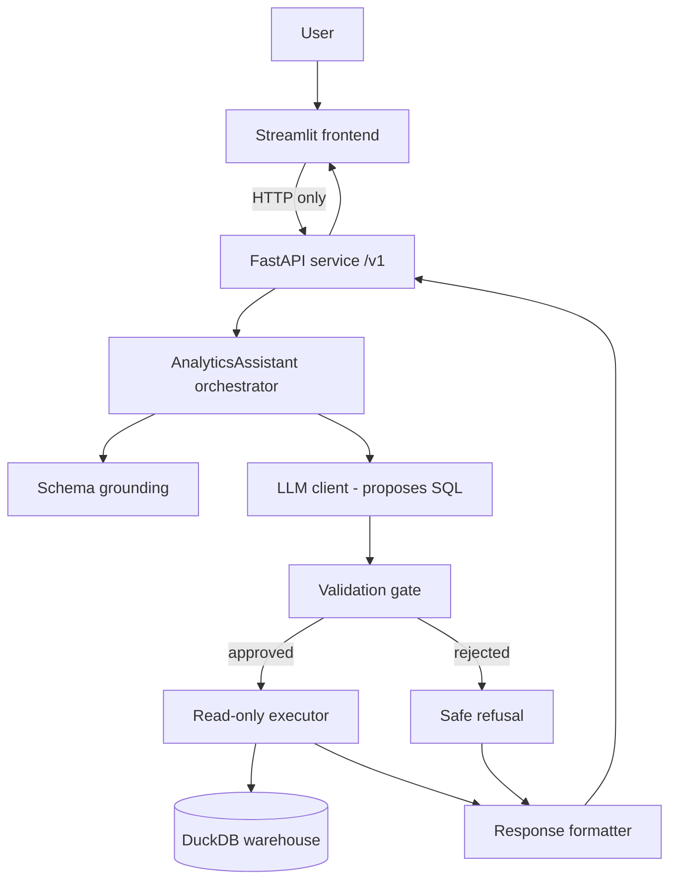
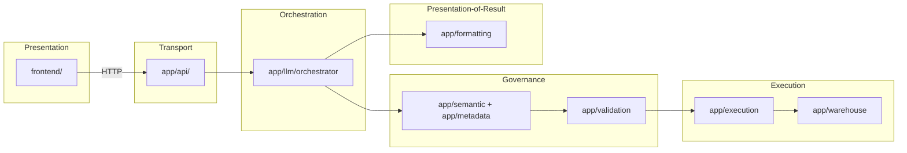
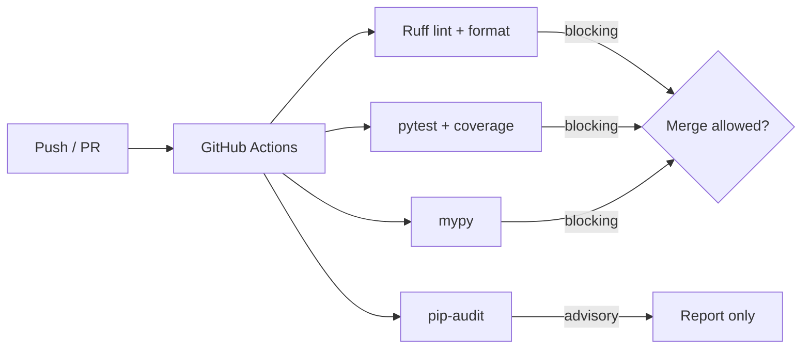

# Architecture State — Solstice Intelligence

**Snapshot as of:** Milestone 3, Phase B (developer experience) — release `v1.2.2` planned
**Purpose:** the authoritative architecture reference. A new engineer should be
able to read this document and understand the system without reading the project's
development history. This describes *architecture*, not history.

---

## 1. Repository Purpose

Solstice Intelligence is a **governed natural-language analytics assistant**. A
user asks a business question in plain English; the system produces a validated
answer computed against a dimensional data warehouse, and returns the exact SQL
that ran alongside a plain-English explanation.

Its defining property is governance: a large language model (LLM) proposes SQL,
but that SQL is treated as untrusted and must pass a strict validation gate before
anything executes. The organizing principle throughout is:

> **The LLM reasons. The warehouse provides truth. Validation decides trust.**

The LLM never touches the database directly.

---

## 2. High-Level Architecture



Two processes at runtime: the **backend service** (FastAPI over the governed
engine) and the **frontend** (Streamlit). They communicate only over HTTP.

---

## 3. Layered Architecture



Dependencies point in one direction: presentation depends on transport, transport
depends on the engine, the engine depends on the warehouse. Nothing lower depends
on anything higher. The frontend depends on nothing in `app/` at all — only on the
HTTP contract.

---

## 4. Directory Structure

```
app/
    warehouse/     read-only DuckDB connection + schema introspection
    metadata/      structural metadata (tables, columns, types)
    models/ reserved namespace for shared internal models (currently empty)
    semantic/      grounding: presenting the schema to the LLM
    validation/    the SQL validation gate (parsing, rules, bounds, decision)
    execution/     read-only query executor + typed results
    llm/           LLM client, tool definition, orchestrator (AnalyticsAssistant)
    formatting/    deterministic response formatting (no LLM narration)
    api/           FastAPI service: models, routes, mapping, dependencies, main
frontend/
    config.py      presentation/client config (API URL, timeout, page)
    models.py      typed mirror of the public API contract + client Protocol
    api_client.py  the sole HTTP boundary (RealApiClient)
    fake_client.py test double implementing the same Protocol
    components.py  pure rendering functions
    streamlit_app.py  the UI entry point
    scripts/
init.py developer tooling package (not part of the runtime pipeline)
verify_env.py deterministic environment diagnostic (no network, zero API cost)
tests/             backend tests
frontend/tests/    frontend tests
docs/adr/          architecture decision records (ADR-004 … ADR-011)
.github/workflows/ CI workflow
requirements.txt runtime dependencies (pinned ==)
requirements-dev.txt development / tooling dependencies (pinned ==)
justfile developer task runner (convenience; CI runs commands directly)
pyproject.toml     centralized tool configuration and the sole version definition
```

Project version metadata is maintained solely in `pyproject.toml`
(`[project].version`). There is no separate runtime version module.

---

## 5. Responsibilities of Every Major Package

- **`app/warehouse`** — opens the DuckDB warehouse in read-only mode and
  introspects its live schema. The physical read-only guarantee originates here.
- **`app/metadata`** — a typed, structural description of the warehouse (tables,
  columns, types) used to ground the LLM and to validate references.
- **`app/models`** — a reserved namespace for shared internal models. Currently
  empty; models owned by a single layer live with that layer (the public API
  contract in `app/api/models.py`, execution results in `app/execution`,
  orchestration results in `app/llm`, formatting responses in `app/formatting`).
- **`app/semantic`** — grounding: turning the metadata into the schema context the
  LLM is shown, so it proposes queries against real tables and columns.
- **`app/validation`** — the trust boundary. Parses proposed SQL, applies rules
  (read-only only, real tables only, no dangerous constructs), enforces row
  bounds, and produces an approve/reject decision.
- **`app/execution`** — runs only approved queries, read-only, with an independent
  row-cap backstop; returns typed results.
- **`app/llm`** — the LLM client (the sole place the AI SDK is used), the single
  tool the model may call, and the orchestrator that walks a question through the
  pipeline.
- **`app/formatting`** — turns pipeline outcomes into a structured response and a
  template explanation. It never lets the LLM interpret the data.
- **`app/api`** — the FastAPI service: the frozen public `/v1` contract, request
  validation, dependency injection, health/readiness/version endpoints, and the
  mapping from internal results to the public shape.
- **`frontend`** — the Streamlit presentation layer, a pure HTTP client of the API.

---

## 6. Data Flow

1. A question arrives (via the frontend → API, or directly to the API).
2. The orchestrator grounds the question in the live schema.
3. The LLM proposes SQL by calling the single permitted tool.
4. The proposed SQL passes through the validation gate.
5. If approved, the read-only executor runs it against the warehouse; if rejected,
   a safe refusal is produced.
6. The formatter builds a structured response (columns/rows, or a refusal) plus a
   plain explanation and the exact SQL.
7. The API returns the public-contract response; the frontend renders it.

---

## 7. LLM Boundaries

- The LLM is reached through exactly one module (`app/llm/client.py`); no other
  code imports the AI SDK.
- The LLM's only sanctioned action is to call one tool that proposes a SQL string.
- The proposed SQL is powerless until the validation gate approves it.
- The LLM never executes SQL, never sees raw results to "interpret," and never
  narrates the answer — explanations are template-based and deterministic.
- The provider/model identity is internal and never appears in the public API
  contract.

---

## 8. Validation Pipeline

The gate is allowlist-first and defense-in-depth:

1. **Parse** the proposed SQL into an abstract syntax tree (AST).
2. **Statement-type rule** — only read-only query forms are permitted
   (SELECT/UNION and related); anything else is rejected.
3. **Reference rules** — every referenced table/column must resolve to a real
   warehouse object; table functions and empty-named sources are rejected
   structurally (this closed a real file-disclosure exploit found in testing).
4. **Bounds** — a row LIMIT is injected if absent and clamped if it exceeds the cap.
5. **Decision** — approve (produce safe SQL) or reject (produce explained errors).

A rejection is a legitimate, explained outcome — not an error.

---

## 9. Execution Pipeline

- Accepts only gate-approved SQL (a typed trust boundary prevents running anything
  else).
- Executes read-only against DuckDB.
- Applies an independent row-cap backstop, so even an approved query cannot return
  an unbounded result.
- Returns typed results (columns, rows, row count, truncation flag, timing).

---

## 10. Frontend Architecture

- A thin Streamlit client whose only backend contact is HTTP to the `/v1` API.
- One module (`api_client.py`) owns the HTTP implementation; everything else
  depends on a small client `Protocol`, so the HTTP library or the client
  implementation can change without touching the UI.
- Rendering components are pure: they never perform HTTP, never mutate state,
  never contain business logic, never return business data.
- A render-only transcript provides the feel of a conversation; each request sends
  exactly one question — no prior context is resent (single-turn by design).
- The request lifecycle (Idle → Submitting → Waiting → Response → Idle) governs the
  submit button to prevent duplicate submissions.

---

## 11. Testing Architecture

- **Deterministic and zero-cost.** The LLM is substituted with a fake client and
  HTTP is mocked, so no test needs the network, a real AI call, or secrets.
- Backend tests cover each engine layer, the API contract and HTTP semantics, and
  the adversarial validation cases.
- Frontend tests cover the API client's request-building and error categorization,
  the pure render components, and the interaction flow.
- Tooling tests cover the environment diagnostic (`scripts/verify_env.py`) with
  deterministic fixtures (missing/corrupt warehouse, missing variable,
  configuration validity, registry order, readiness, `main`).
- The assembled Streamlit UI is verified manually (honest scoping: the framework's
  re-run model makes full UI automation impractical to claim).

Current suite: **112 tests passing**, **84% coverage** (coverage is informational).

---

## 12. Dependency Philosophy

- Dependencies flow one way (presentation → transport → engine → warehouse); no
  cycles.
- External systems are each isolated behind a single module (the AI SDK behind the
  LLM client; HTTP behind the API client), so they can be swapped with minimal blast
  radius.
- The frontend couples to the public API contract, never to internal engine types.
- Runtime and development dependencies are separated (`requirements.txt` and
  `requirements-dev.txt`) and pinned exactly, so installs are reproducible and the
  blocking gates are deterministic.

---

## 13. CI/CD Pipeline



CI runs on every push and pull request on Python 3.14, installs both requirements
files (caching on both), requires no secrets, and spends nothing on the AI
provider (the suite is deterministic). CI executes the tool commands directly; the
`justfile` wraps the same commands for developer convenience only.

---

## 14. Quality Gates

| Check | Policy |
|---|---|
| Tests (pytest) | **Blocking** |
| Ruff (lint + format) | **Blocking** |
| mypy (type checking) | **Blocking** (promoted from advisory after reaching zero findings) |
| Coverage | Informational (never gates) |
| pip-audit (dependency scan) | Advisory (never gates — a changing CVE database would make builds non-deterministic) |

Principle: gate only on checks that are deterministic and actionable; report
everything else.

---

## 15. ADR Summary

| ADR | Subject |
|---|---|
| ADR-004 | Structural metadata layer |
| ADR-005 | SQL validation gate |
| ADR-006 | Execution engine |
| ADR-007 | LLM orchestration |
| ADR-008 | Response formatting (deterministic, no LLM narration) |
| ADR-009 | API service boundary (frozen `/v1` contract, HTTP semantics, lifecycle) |
| ADR-010 | Frontend–backend HTTP boundary |
| ADR-011 | CI & quality-gate policy (blocking vs advisory; mypy promotion) |

---

## 16. Design Principles

- The warehouse is the source of truth; the LLM only proposes.
- Untrusted LLM output must pass validation before execution.
- Each module has a single responsibility.
- Boundaries are enforced structurally, not by convention.
- Decisions are recorded as ADRs.
- Finished layers are frozen and built upon, not reopened.
- Tests are deterministic and free to run.

---

## 17. Important Invariants

- The LLM is never trusted to execute SQL directly.
- Only gate-approved SQL can reach the executor.
- Execution is read-only, with an independent row-cap backstop.
- The frontend never imports backend modules — HTTP only.
- The public API contract excludes implementation details (provider/model).
- Explanations are template-based; the LLM never narrates results.
- CI requires no secrets and spends no API credit.

---

## 18. Files That Should Rarely Change

- The validation gate (`app/validation/*`) — the security-critical trust boundary.
- The execution engine (`app/execution/*`) — the read-only guarantees.
- The public API models (`app/api/models.py`) — the frozen contract.
- The LLM client boundary (`app/llm/client.py`) — the single SDK contact point.
- The ADRs — historical decisions; add new ones rather than rewriting old ones.

---

## 19. Extension Points

- **New clients** (React, CLI, chat bots) — build against the frozen `/v1`
  contract; no backend change required.
- **New analytics capability** — extend the engine behind the API without altering
  the contract.
- **New quality checks** — add advisory CI steps; promote to blocking once they
  reach a clean baseline (the pattern mypy followed).
- **Deployment, release automation, operational logging** — the remaining
  Milestone 3 phases, all additive.

---

## 20. Technical Debt

- **Minor, cosmetic:** raw floating-point execution-time values are not rounded for
  display; to be folded into a future UI/operational-logging touch.
- No structural or security debt is outstanding. Frozen layers are clean; the type
  checker is at zero findings.

---

## 21. Future Evolution Considerations

- Remaining Milestone 3 phases: deployment (with an explicit guard against
  unintended API cost on any public endpoint), release engineering, and
  operational hardening (structured logging and diagnostics — not an observability
  platform).
- Deferred by design: conversation memory / multi-turn, authentication, caching,
  automatic query-repair loops, and usage persistence. Each is a deliberate future
  option, not an accidental omission.
- Any future change to a frozen layer should be justified by an ADR, not made
  casually.