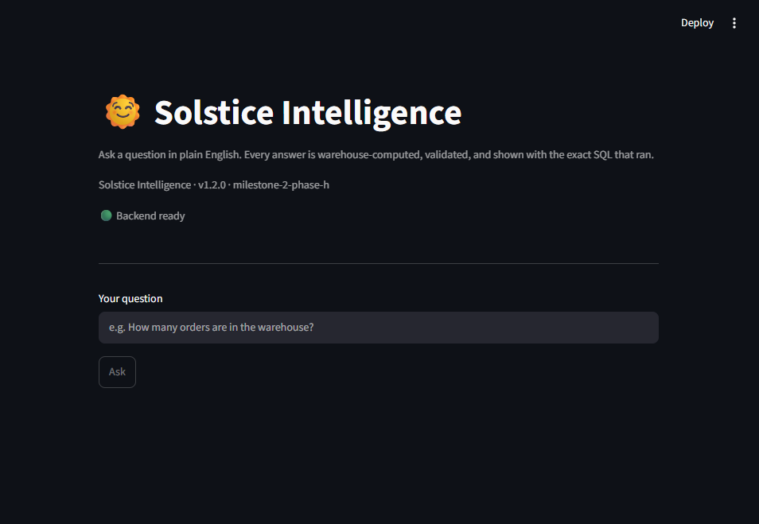
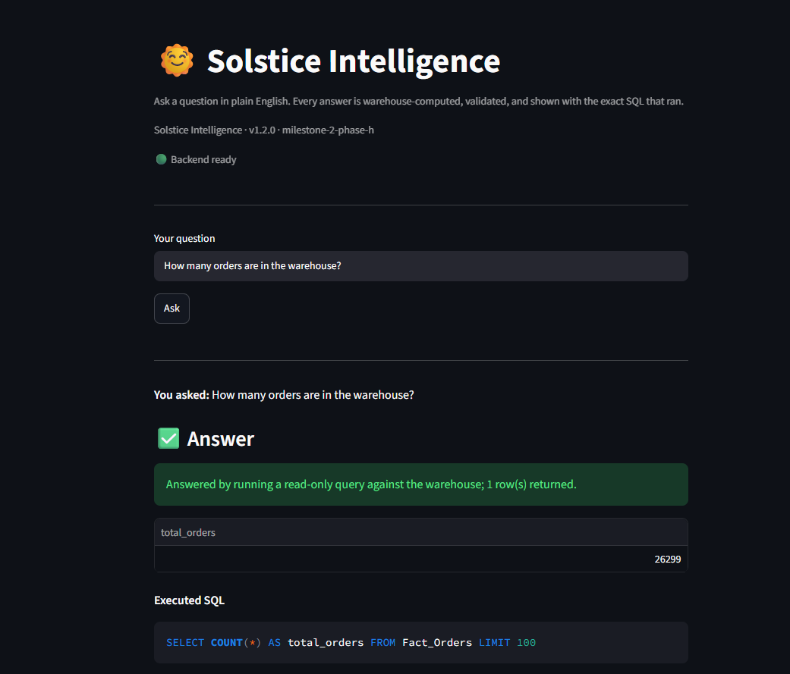
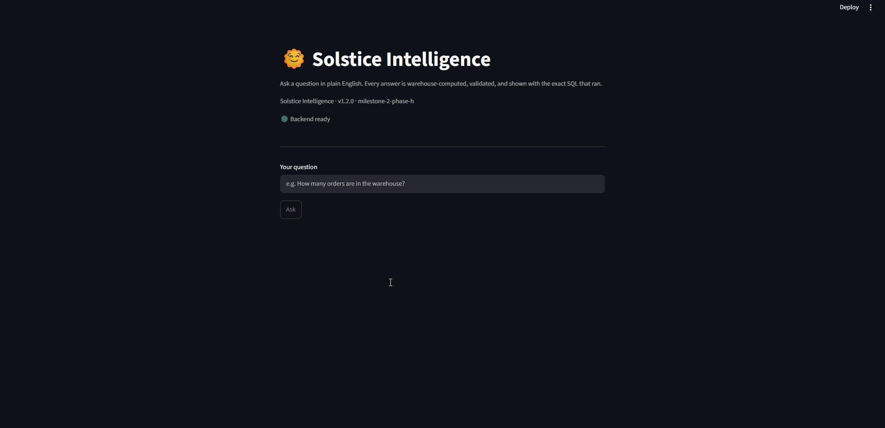

# Solstice Intelligence

> A governed natural-language analytics platform that lets business
> users query a dimensional data warehouse using plain English while
> validating every AI-generated SQL statement before execution.


------------------------------------------------------------------------

## Overview

Solstice Intelligence is a production-style analytics project that
explores how large language models can be used safely for business
intelligence.

Instead of allowing an AI model to generate and execute SQL directly,
every query passes through a governed pipeline that validates the
generated SQL before it reaches the warehouse. The goal is to build an
analytics assistant that is accurate, transparent, and easy to trust.

The project is being developed in milestones. At the end of **Milestone
2 -- Phase G**, the repository contains a fully governed analytics
backend together with a versioned REST API.

------------------------------------------------------------------------

## Why I Built This

Many AI-powered SQL assistants focus on generating queries quickly. This
project focuses on engineering discipline.

The main questions behind Solstice Intelligence are:

-   How can an AI assistant answer questions without blindly trusting
    AI-generated SQL?
-   How can a warehouse remain the source of truth?
-   How can an analytics system be designed so that each layer has a
    single responsibility?

The result is a layered architecture with clear boundaries, automated
validation, and deterministic execution.

------------------------------------------------------------------------

## Key Features

-   Natural-language analytics using the OpenAI Responses API
-   Schema-aware SQL generation
-   SQL validation using sqlglot
-   Allowlist-first validation rules
-   Read-only query execution
-   DuckDB dimensional warehouse
-   FastAPI REST API (`/v1`)
-   Health, readiness, and version endpoints
-   OpenAPI / Swagger documentation
-   Request ID tracing
-   Typed response models
-   Automated regression testing

------------------------------------------------------------------------

## High-Level Architecture

``` text
Business User
      │
      ▼
 FastAPI REST API
      │
      ▼
 AnalyticsAssistant
      │
      ▼
 Schema Grounding
      │
      ▼
 OpenAI Responses API
      │
      ▼
 SQL Validation Gate
      │
      ▼
 Read-only Executor
      │
      ▼
 DuckDB Warehouse
      │
      ▼
 Structured Response
```

> **The LLM reasons. The warehouse provides truth.**

------------------------------------------------------------------------

## Repository Structure

``` text
solstice-intelligence/
├── app/
│   ├── api/
│   ├── execution/
│   ├── formatting/
│   ├── llm/
│   ├── metadata/
│   ├── semantic/
│   ├── validation/
│   └── warehouse/
│
│── frontend/
│   ├── streamlit_app.py
│   ├── api_client.py
│   ├── fake_client.py
│   ├── models.py
│   ├── components.py
│   ├── config.py
│   └── tests/
│
├── docs/
│   ├── adr/
│   └── assets/
│
├── scripts/
├── tests/
├── data/
├── README.md
└── LICENSE
```

------------------------------------------------------------------------

## Engineering Principles

-   The warehouse is the source of truth.
-   AI output is never trusted without validation.
-   Business logic and presentation stay separate.
-   Every architectural decision is documented with an ADR.
-   Public APIs are versioned and treated as stable contracts.
-   New features should not weaken existing guarantees.

------------------------------------------------------------------------

## REST API (Phase G)

**Main endpoint**

`POST /v1/ask`

Supporting endpoints:

-   GET /health
-   GET /ready
-   GET /version

Swagger documentation is available after starting the API.

------------------------------------------------------------------------

## Web Interface (Milestone 2 · Phase H)
 
A thin Streamlit client provides a browser interface to the assistant. It
consumes the REST API only — it never imports backend modules — so the
presentation layer is fully decoupled from the governed pipeline and could be
replaced by any other HTTP client (React, CLI, a chat bot) without backend
changes (see ADR-010).
 
The interface reinforces the project's governing philosophy — *the LLM reasons,
the warehouse provides truth, validation decides trust* — by making the governed
workflow visible: every answer shows the structured result, the exact SQL that
ran, a plain-English explanation of what the system did, and request metadata.
 
**Architecture**
 
```
Browser → Streamlit (frontend/) → HTTP → FastAPI (/v1) → AnalyticsAssistant → governed backend → DuckDB
```
 
**Running it locally**
 
```bash
# 1. start the API (backend)
uvicorn app.api.main:app --reload
 
# 2. in a second terminal, start the UI
streamlit run frontend/streamlit_app.py
 
# optional: point the UI at a non-default API
SOLSTICE_API_URL=http://localhost:8000 streamlit run frontend/streamlit_app.py
```
 
The UI displays the backend version (from `GET /version`) and a readiness
indicator (from `GET /ready`), so the versioned, health-checked architecture is
visible in the interface itself. 
The screenshots below show the released Phase H interface communicating with the governed REST API.
 
## Interface Preview

### Homepage



### Successful Analytics Query



### Live Demonstration


 
**Design notes (Phase H)**
 
- The frontend is intentionally thin: presentation, interaction, and REST
  communication only. No business logic, SQL, validation, or orchestration.
- Each question is an independent request — the on-screen transcript is
  render-only and is never resent to the model (conversation memory is deferred).
- Frontend tests are deterministic and zero-cost: a `FakeApiClient` (sharing the
  same protocol as the real client) and an httpx mock transport mean no server,
  network, or OpenAI call is needed. The assembled UI is verified manually.

------------------------------------------------------------------------

## Testing & Verification

### Automated

-   101 automated tests (Backend: 86, Frontend: 15)
-   API regression tests
-   Validation tests
-   Orchestrator tests
-   Warehouse tests

### Manual release verification

-   Application startup
-   Health endpoint
-   Readiness endpoint
-   Version endpoint
-   Swagger / OpenAPI
-   Successful governed analytics query
-   Invalid request handling
-   Truthful no-query behaviour

------------------------------------------------------------------------

## Current Status

### Milestone 1 (Complete & Frozen)

-   Warehouse integration
-   Schema grounding
-   SQL validation gate
-   Read-only execution
-   Response formatting

### Milestone 2

**Phase G (Complete & Frozen)**

-   FastAPI API
-   Versioned REST contract
-   Dependency injection
-   Request ID middleware
-   OpenAPI documentation
-   Health/readiness endpoints
-   API regression tests

**Phase H (Complete & Frozen)**

-   Streamlit frontend
-   HTTP-only presentation layer
-   Typed API client
-   Pure rendering components
-   ADR-010
-   Frontend regression tests
-   REST-based UI

**Phase I (Planned)**

-   Deployment
-   Operational improvements

------------------------------------------------------------------------

## Technology Stack

-   Python
-   FastAPI
-   DuckDB
-   OpenAI Responses API
-   sqlglot
-   Pydantic
-   Pytest
-   Git

------------------------------------------------------------------------

## Getting Started

``` bash
pip install -r requirements.txt

# Terminal 1
python -m uvicorn app.api.main:app --reload

# Terminal 2
streamlit run frontend/streamlit_app.py
```

Open:

`http://127.0.0.1:8000/docs`

------------------------------------------------------------------------

## Roadmap

-   Milestone 1: Governed backend ✅
-   Milestone 2 -- Phase G: REST API ✅
-   Milestone 2 -- Phase H: Streamlit frontend ✅
-   Milestone 2 -- Phase I: Deployment

------------------------------------------------------------------------

## License

MIT License

------------------------------------------------------------------------

## Author

**Tejas Jaggi**

M.S. in Information Management

University of Illinois Urbana-Champaign
